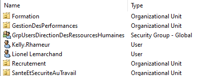
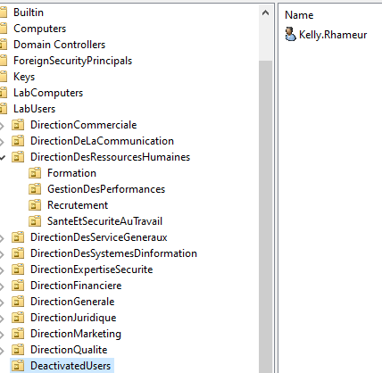
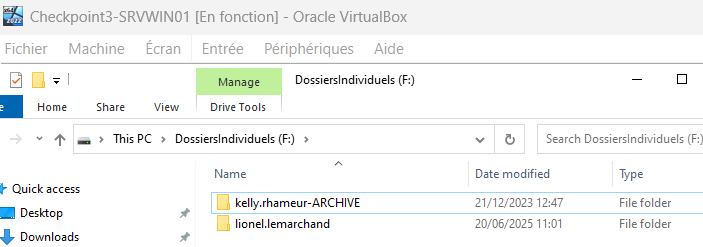
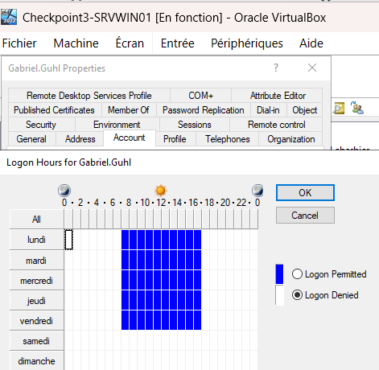
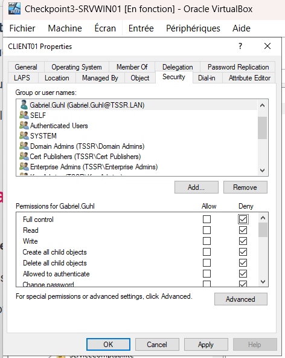
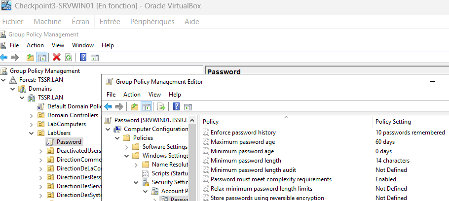
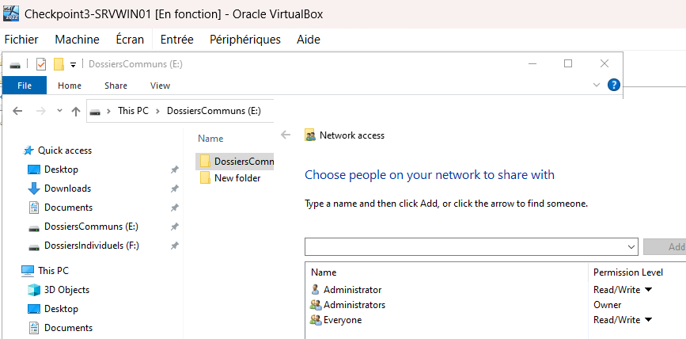
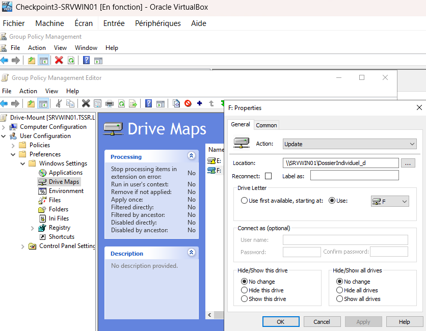

### Partie 1 : Gestion des utilisateurs
#### Q.1.1.1

### Partie 1 : Gestion des utilisateurs
#### Q.1.1.2

### Partie 1 : Gestion des utilisateurs
#### Q.1.1.3

### Partie 1 : Gestion des utilisateurs
#### Q.1.1.4

### Partie 2 : Restriction utilisateurs
#### Q.1.2.1

### Partie 2 : Restriction utilisateurs
#### Q.1.2.2

### Partie 2 : Restriction utilisateurs
#### Q.1.2.3

### Partie 3 : Lecteurs réseaux
#### Q.1.3.1
Les lecteurs E et F sont sur un disque local (visible via la console Disk Management).  
On av donc créer des dossiers dans chacun de ces lecteurs, puis partager ces dossiers et les mapper:  
Partage du dossier avec Everyone (on pourrait être plus précis mais c'est aps demandé) :  

On déplace les contenu des lecteurs dans ces nouveaux dossiers créés.  
Puis création de la GPO :

avec E et F (donc deux fois New Mapped Drive)
