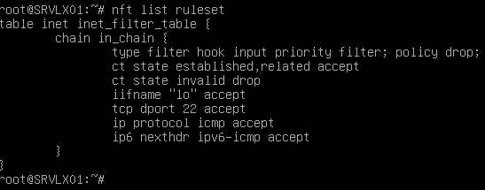

### Partie 1 : Gestion des utilisateurs
#### Q.2.1.1
``adduser test`` test etant le nom de l'utilisateur créée  
Puis on entre le mot de apsse et quelques informations (ces informations ne sont aps nécessaires)  
Puis pour vérifier :  
``cat /etc/passwd | grep test``

### Partie 1 : Gestion des utilisateurs
#### Q.2.1.2
``usermod -aG sudo test``  
puis pour vérifier :  
``groups test``  

### Partie 2 : Configuration de SSH
#### Q.2.2.1
``nano /etc/ssh/sshd_config/``  

### Partie 2 : Configuration de SSH
#### Q.2.2.2
``nano /etc/ssh/sshd_config/``  

### Partie 2 : Configuration de SSH
#### Q.2.2.3
Il faut deja avoir une autre machine (cliente) sur le même réseau interne.  
Génération de la clé ssh avec ``ssh-keygen``  
``nano /etc/ssh/sshd_config/``  
Puis l'envoyer avec ``ssh-copy-id``  

### Partie 3 : Analyse du stockage
#### Q.2.3.1
``df -hT``   

### Partie 3 : Analyse du stockage
#### Q.2.3.2
``df -hT | awk '{print $2}'``  

### Partie 3 : Analyse du stockage
#### Q.2.3.3
  
Sur VirtalBox :  
1- CLiquer sur la VM, puis **Configuration**  
2- Aller dans **Stockage**  
3- Ajoute un nouveau stockage  
4- Créer un disque (ou en choisir un selon)  
5- Choisir la taille du disque (ici 8Go)  
6- **Finish** et **Choose** en ayant sélectionné le disque  

### Partie 3 : Analyse du stockage
#### Q.2.3.4
``lsblk`` pour voir le nom du disque qu'on vioent d'ajouter, ici /dev/sdb
``vgcreate save /dev/sdb`` pour créer un VG "save"  
``lvcreate -L 2G -n Sauvegardes save`` pour créer un LV "Sauvegarde de 2Go depuis le VG "save"  
``mkfs.ext4 /dev/save/Sauvegardes`` formate le LV par un systeme de fichier ici ext4  
``mount /dev/save/Sauvegardes /var/lib/bareos/storage`` On monte d'abord manuellement pour vérifier que tout va bien  
puis pour le monter de manière automatique :  
 

### Partie 3 : Analyse du stockage
#### Q.2.3.5
  

### Partie 4 : Sauvegardes
#### Q.2.4.1
bareos-dir : pour bareos director, grand organisateur, il s'occupe de la plannification et de l'organisation. Il est sur la machine principale  
bareos-sd : pour bareos storage daemon, responsable de l'écriture des donénes pour la sauvegarde   
bareos-fd : pour bareos file daemon, suit les ordres du directeur (comme pour la restauration par exemple). il est sur la machine cliente   

### Partie 5 : Filtrage et analyse réseau
#### Q.2.5.1

### Partie 5 : Filtrage et analyse réseau
#### Q.2.5.2
Sont autorisés :  
les pings IPv4 (ip protocol icmp)
les pings IPv6 (ipv6-icmp)
le ssh (tcp dport 22) si le port n'a pas été changé
les communications loopback (lo)
et ce qui est deja établi ou relié (state established,related)

### Partie 5 : Filtrage et analyse réseau
#### Q.2.5.3
Est interdit :  
ce qui est invalide (state invalid)

### Partie 5 : Filtrage et analyse réseau
#### Q.2.5.4
``nft add rule inet inet_filter_table tcp dport 9101 accept``  
``nft add rule inet inet_filter_table tcp dport 9103 accept``  
Vérification :  

### Partie 6 : Analyse de logs
#### Q.2.6.1
